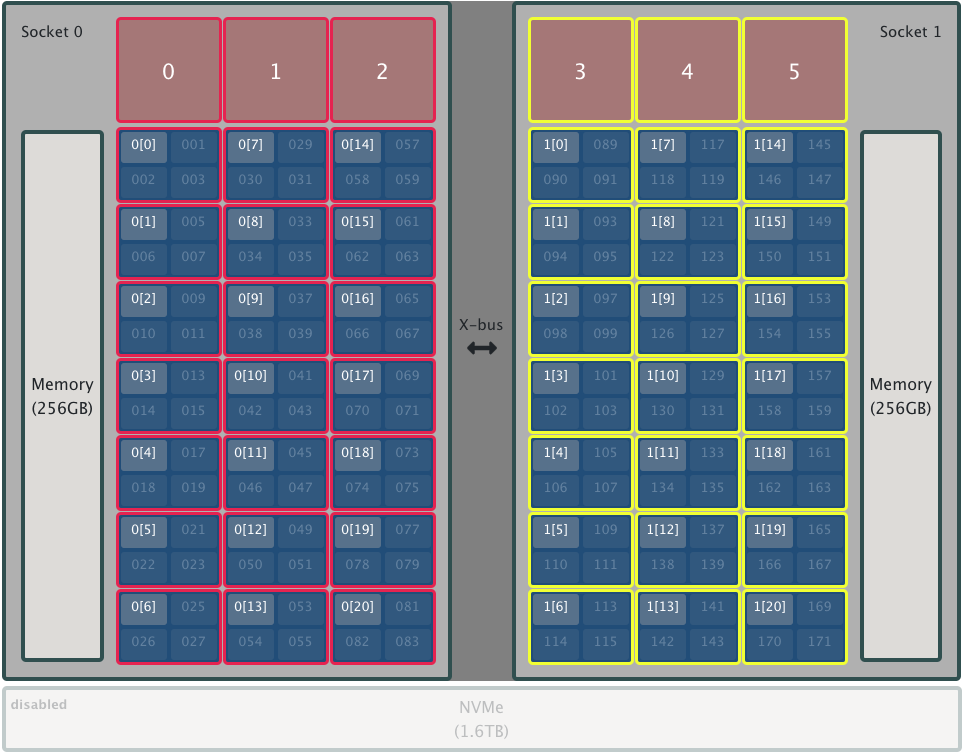
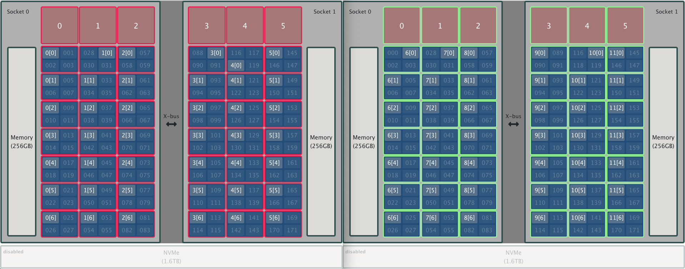
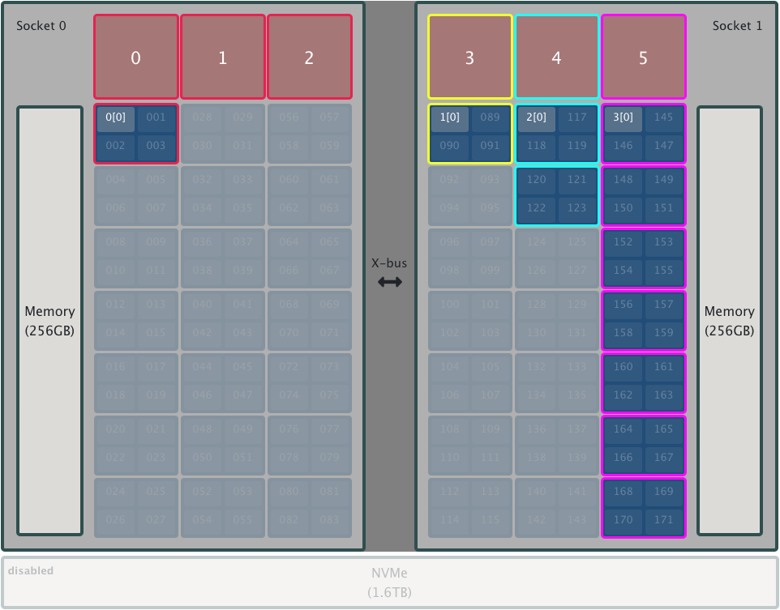

# ERF Exercises

For these exercises, you should request access to 2 Summit nodes in an interactive session. To do so, issue the following command from a Summit login node:

```
$ bsub -P <PROJID> -nnodes 2 -W 60 -alloc_flags gpumps -Is /bin/bash
```

where `<PROJID>` will need to be replaced with an OLCF project you are associated with. 

> NOTE: The `-alloc_flags gpumps` flag enables CUDA MPS on the GPUs in your allocation.

To run these exercises, you can use the following tools:

* job-step-viewer
* Hello_jsrun

## Exercise 1

Create an ERF and use it to launch a job with the following characteristics:

* 2 resource sets (RSs) on a single node - 1 per socket
	* Each RS contains all resources on a socket (i.e., 84 HW threads and 3 GPUs)
	* Each RS has 1 MPI rank that spawns 21 OpenMP threads (1 thread per physical core)

So the results should look like the image below. 

> NOTE: By default, the OpenMP threads will be placed on the physical cores available to an MPI rank in a round-robin fashion. 

<br>
<center>
<a href="./images/exercise_1.png"></a>
</center>
<br>

## Exercise 2

Create an ERF and use it to launch a job with the following characteristics:

* 2 RSs (1 per node)
	* Each RS contains all resources on a node (all HW threads and all GPUs)
	* Each RS has 6 MPI ranks that have access to 28 HW threads (i.e., 7 physical cores) and all GPUs
	* Each MPI rank spawns 7 OpenMP threads (1 per physical core)


> NOTE: Although each RS will contain "all" HW threads and GPUs on a node, you will still need to bind MPI ranks to sets of HW threads.
> 
> Hint: In each RS, you will need 6 sets of HW threads to map the 6 MPI ranks to (see Example 2 from the slides)

So the results should look like the image below. 

<br>
<center>
<a href="./images/exercise_2.png"></a>
</center>
<br>

## Exercise 3

Create an ERF and use it to launch a job with the following characteristics:

* 4 RSs
	* 1 RS on the first socket containing HW threads 0-3 and GPUs 0,1,2
		* 1 MPI rank can access these resources
	* 3 RSs on the second socket
		* 1 RS containing HW threads 88-91 and GPU 3.
			* 1 MPI rank can access these resources
		* 1 RS containing HW threads 116-123 and GPU 4.
			* 1 MPI rank can access these resources
		* 1 RS containing HW threads 144-171 and GPU 5.
			* 1 MPI rank can access these resources

So the results should look like the image below. 

<br>
<center>
<a href="./images/exercise_3.png"></a>
</center>
<br>

## Exercise 4

Using the MPMD code example provided in the examples/ directory, create an MPMD layout that represents a master-worker setup, with the master rank running `run_a` (as a proxy for a task-management code) and all other ranks running `run_b`. 

To do so, use an ERF that defines:

* A resource set on each node with 6 MPI ranks that each have access to 4 HW threads (i.e., 1 physical core). These MPI ranks should all run program `run_b`.

* 1 additional resource set on the first node with 1 MPI rank that has access to 4 HW threads (i.e., 1 physical core). This MPI rank should run program `run_a`.

	* So there should be 2 resource sets on the first node but only 1 on the second node.

The output should look similar to the following:

```
$ jsrun --erf_input example5.erf | sort
MPI rank 00 of 13 on HW Thread 001 of Node h27n01 - (Code a)
MPI rank 01 of 13 on HW Thread 005 of Node h27n01 - (Code b)
MPI rank 02 of 13 on HW Thread 009 of Node h27n01 - (Code b)
MPI rank 03 of 13 on HW Thread 013 of Node h27n01 - (Code b)
MPI rank 04 of 13 on HW Thread 088 of Node h27n01 - (Code b)
MPI rank 05 of 13 on HW Thread 092 of Node h27n01 - (Code b)
MPI rank 06 of 13 on HW Thread 098 of Node h27n01 - (Code b)
MPI rank 07 of 13 on HW Thread 004 of Node h27n02 - (Code b)
MPI rank 08 of 13 on HW Thread 009 of Node h27n02 - (Code b)
MPI rank 09 of 13 on HW Thread 012 of Node h27n02 - (Code b)
MPI rank 10 of 13 on HW Thread 090 of Node h27n02 - (Code b)
MPI rank 11 of 13 on HW Thread 093 of Node h27n02 - (Code b)
MPI rank 12 of 13 on HW Thread 097 of Node h27n02 - (Code b)
```

> NOTE: `job-step-viewer` does not currenly support MPMD mode.
