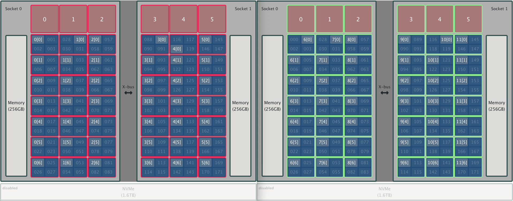

# ERF Exercises

## Exercise 1

Using an ERF, create 2 identical resource sets (1 per node), each containing all resources on a node (i.e., all HW threads and GPUs). Each resource set has 6 MPI ranks that have access to 28 HW threads (i.e., 7 physical cores) and all GPUs.

<br>
<center>
<a href="./images/exercise1.png"></a>
</center>
<br>

## Exercise 2

Using the MPMD code example provided above, create an MPMD layout that represents a master-worker setup, with the master rank running `run_a` (as a proxy for a task-management code) and all other ranks running `run_b`. 

To do so, use an ERF that defines:

* A resource set on each node with 6 MPI ranks that each have access to 4 HW threads (i.e., 1 physical core). These MPI ranks should all run program `run_b`.

* 1 additional resource set on the first node with 1 MPI rank that has access to 4 HW threads (i.e., 1 physical core). This MPI rank should run program `run_a`.

	* So there should be 2 resource sets on the first node but only 1 on the second node.

The output should look similar to the following:

```
$ jsrun --erf_input example5.erf | sort
MPI rank 00 of 13 on HW Thread 001 of Node h27n01 - (Code a)
MPI rank 01 of 13 on HW Thread 005 of Node h27n01 - (Code b)
MPI rank 02 of 13 on HW Thread 009 of Node h27n01 - (Code b)
MPI rank 03 of 13 on HW Thread 013 of Node h27n01 - (Code b)
MPI rank 04 of 13 on HW Thread 088 of Node h27n01 - (Code b)
MPI rank 05 of 13 on HW Thread 092 of Node h27n01 - (Code b)
MPI rank 06 of 13 on HW Thread 098 of Node h27n01 - (Code b)
MPI rank 07 of 13 on HW Thread 004 of Node h27n02 - (Code b)
MPI rank 08 of 13 on HW Thread 009 of Node h27n02 - (Code b)
MPI rank 09 of 13 on HW Thread 012 of Node h27n02 - (Code b)
MPI rank 10 of 13 on HW Thread 090 of Node h27n02 - (Code b)
MPI rank 11 of 13 on HW Thread 093 of Node h27n02 - (Code b)
MPI rank 12 of 13 on HW Thread 097 of Node h27n02 - (Code b)
```

> NOTE: `job-step-viewer` does not currenly support MPMD mode.
